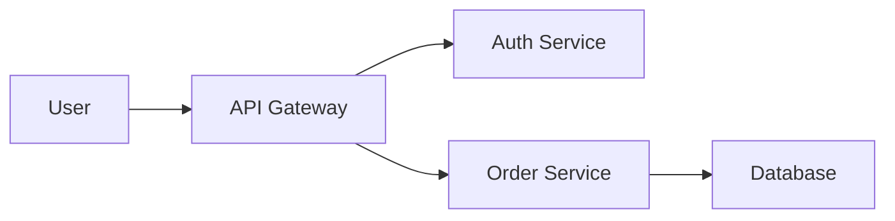

# TechnicalDiagram Workflow

Generate clean, professional technical diagrams and architecture visualizations for documentation, presentations, and blog posts.

## Purpose

Create technical diagrams including system architecture, data flow diagrams, network topology, API structures, and process flowcharts using AI image generation with a focus on clarity and professionalism.

## When to Use

**Use this workflow for:**
- System architecture diagrams
- Microservices topology
- Data flow visualizations
- Network diagrams
- API structure representations
- Database schema visualizations
- Process flowcharts
- Infrastructure diagrams

**Don't use this workflow for:**
- Detailed labeled diagrams (use Excalidraw, Mermaid, or draw.io for text-heavy diagrams)
- Precise technical specs (AI struggles with exact measurements)
- Real-time collaboration (AI-generated are static)

**Best use:** Generate base visual, then add labels/text using diagram tools.

## Process

### 1. Define Diagram Type

**Choose diagram category:**

#### System Architecture
- Microservices
- Monolith decomposition
- Cloud infrastructure
- Serverless architecture
- Client-server architecture

#### Data Flow
- ETL pipelines
- Message queues
- Event streaming
- Data warehouse architecture
- Real-time analytics

#### Network
- Network topology
- VPN configurations
- Firewall rules visualization
- Load balancer setup
- CDN architecture

#### API Structure
- REST API endpoints
- GraphQL schema
- Webhook flows
- Authentication flows
- Rate limiting

#### Process Flow
- CI/CD pipeline
- Deployment process
- Approval workflows
- Data processing pipeline
- User journey

**Output:** Diagram type and specific elements to include

### 2. Identify Key Components

**List all elements that should appear:**

#### For System Architecture
- **Services/components:** API gateway, auth service, database, cache, etc.
- **External systems:** Third-party APIs, payment processors, analytics
- **Infrastructure:** Load balancers, CDN, object storage
- **Connections:** HTTP, gRPC, message queues, webhooks

**Example - Microservices:**
```
Components:
- API Gateway (entry point)
- 5 microservices (user, order, payment, inventory, notification)
- 3 databases (user DB, order DB, inventory DB)
- Redis cache
- Message queue (RabbitMQ)
- External: Payment processor (Stripe)
```

#### For Data Flow
- **Data sources:** Databases, APIs, files, streams
- **Processing:** ETL jobs, transformations, aggregations
- **Storage:** Data warehouse, data lake, cache
- **Outputs:** Dashboards, reports, APIs

#### For Network
- **Devices:** Servers, routers, switches, firewalls
- **Connections:** Physical links, VPN tunnels, internet
- **Zones:** DMZ, private network, public internet

**Output:** Complete component list with relationships

### 3. Design Layout

**Determine visual hierarchy:**

#### Top-to-Bottom Flow
**Best for:** User flows, CI/CD pipelines, waterfall processes

```
User/Client
    ↓
Load Balancer
    ↓
Application Servers
    ↓
Database
```

#### Left-to-Right Flow
**Best for:** Data pipelines, ETL processes, API calls

```
Source → Processing → Storage → Output
```

#### Centered Hub-and-Spoke
**Best for:** Microservices with API gateway, hub architecture

```
       Service 1
           ↑
Service 4 ← Gateway → Service 2
           ↓
       Service 3
```

#### Layered Architecture
**Best for:** Network stack, application layers, infrastructure

```
┌─────────────────────┐
│   Presentation      │
├─────────────────────┤
│   Business Logic    │
├─────────────────────┤
│   Data Access       │
├─────────────────────┤
│   Database          │
└─────────────────────┘
```

#### Isometric/3D View
**Best for:** Infrastructure, multi-tier architecture, cloud services

**Considerations:**
- Where does data/request enter? (Top, left, user side)
- What's the flow direction? (Top-down, left-right)
- How many layers/tiers? (2-tier, 3-tier, N-tier)
- What's the focal point? (Center, gateway, database)

**Output:** Layout description (top-down, left-right, hub-spoke, layered, isometric)

### 4. Craft Technical Diagram Prompt

**Structure:** Diagram type + Components + Layout + Style + Technical details

#### CarbeneAI Technical Style Template

```
Clean [diagram type] diagram, dark background (#0a0a0f),
[components list with visual representations],
glowing connection lines in cyan (#00D4FF),
[layout description],
glass morphism effect on component boxes,
professional technical illustration style,
geometric and precise,
clear visual hierarchy,
minimal and uncluttered,
no text labels (will add separately),
[aspect ratio],
highly detailed, technical drawing quality
```

#### Example - Microservices Architecture

```
Clean microservices architecture diagram, dark space black
background (#0a0a0f), centered API gateway as large geometric
hexagon (magenta glow), 5 smaller service boxes arranged in
circle around gateway (cyan glow), database cylinders beneath
each service (purple/cyan gradient), glowing cyan connection
lines from gateway to services and from services to databases,
message queue represented as horizontal pipeline at bottom
connecting services (magenta), isometric perspective view,
glass morphism translucent effect on all boxes, professional
technical illustration style, clear visual hierarchy, minimal
and uncluttered, geometric precision, no text labels, 16:9
aspect ratio, highly detailed, technical drawing quality

Negative: text, labels, words, cluttered, chaotic, photorealistic,
people, low quality
```

#### Example - Data Flow Pipeline

```
Clean ETL data pipeline diagram, dark background (#0a0a0f),
left-to-right flow layout, data source icons on left (database
cylinders, API symbols - cyan), processing stages in center
(geometric boxes representing ETL steps - magenta gradient),
data warehouse on right (large cylinder with internal layers
visible - purple/cyan), glowing cyan arrows showing data flow
direction between stages, minimal style, technical illustration,
clean and professional, no text labels, 16:9 aspect ratio,
highly detailed

Negative: text, words, cluttered, photorealistic, people
```

#### Example - Network Topology

```
Clean network topology diagram, dark background (#0a0a0f),
centered router/firewall (geometric hexagon - magenta), 4 server
icons arranged in top row (rectangular boxes - cyan), 3 client
devices at bottom (laptop/desktop icons - cyan), glowing cyan
connection lines showing network paths, DMZ zone highlighted
with translucent magenta boundary, private network zone with
cyan boundary, isometric perspective, professional technical
style, geometric and precise, no text labels, 16:9 aspect ratio,
technical drawing quality

Negative: text, labels, photorealistic, cluttered, people
```

### 5. Generate Base Diagram

**Model selection for technical diagrams:**

| Model | Suitability | Why |
|-------|-------------|-----|
| **SDXL** | ⭐⭐⭐⭐⭐ Excellent | Good at geometric shapes, technical style, fast |
| **Playground v2.5** | ⭐⭐⭐⭐ Good | Vibrant colors, clean lines |
| **SDXL Lightning** | ⭐⭐⭐⭐ Good | Fast iterations for testing layouts |
| **Flux 1.1 Pro** | ⭐⭐⭐ Moderate | Overkill for diagrams, slower |
| **DALL-E 3** | ⭐⭐⭐ Moderate | Can be too photorealistic |

**Recommended:** SDXL or Playground v2.5 for technical diagrams

**Generation parameters:**
```json
{
  "prompt": "[Your technical diagram prompt]",
  "negative_prompt": "text, labels, words, cluttered, photorealistic, people, low quality",
  "aspect_ratio": "16:9",
  "output_format": "png",
  "output_quality": 100,
  "num_outputs": 3
}
```

**Generate 3 variations** to choose the best layout/composition.

### 6. Review Base Diagram

**Quality checklist:**

✅ **Clarity**
- Components visually distinct
- Flow/hierarchy clear
- Not too cluttered
- Proper spacing between elements

✅ **Visual hierarchy**
- Important components stand out (size, color, position)
- Secondary elements subdued
- Flow direction obvious

✅ **Style consistency**
- Matches CarbeneAI aesthetic (dark, neon, professional)
- Geometric shapes consistent
- Connection lines uniform

✅ **Technical accuracy (conceptual)**
- Component relationships make sense
- Flow direction logical
- Layers/tiers properly represented

**If issues found:**
- **Too cluttered:** Simplify prompt, reduce number of components
- **Poor layout:** Adjust layout description in prompt (center gateway, top-down flow)
- **Wrong style:** Emphasize "technical illustration, geometric, minimal"
- **Unclear hierarchy:** Specify sizes in prompt (larger gateway, smaller services)

### 7. Add Labels and Text

**AI-generated diagrams lack precise text. Add labels using:**

#### Option A: Figma (Recommended)
1. Import generated image as background
2. Add text boxes for labels
3. Use consistent font (Inter or Orbitron for CarbeneAI)
4. Use cyan (#00D4FF) or white for text
5. Add arrows/callouts if needed
6. Export final version

#### Option B: Excalidraw
1. Import image as background
2. Draw over with Excalidraw elements
3. Add text labels
4. Match hand-drawn aesthetic
5. Export as PNG

#### Option C: draw.io / Diagrams.net
1. Import as background image
2. Add text labels and connectors
3. Export final diagram

#### Option D: Code-based (Mermaid for simple diagrams)
**Note:** For complex diagrams, AI generation + Figma is better than pure code.

But for simple flowcharts, Mermaid is precise:



### 8. Finalize and Deliver

**Post-processing:**
1. **Add labels** (using Figma/Excalidraw)
2. **Add legend** if needed (color coding explanation)
3. **Crop to exact dimensions**
4. **Optimize file size** (PNG for diagrams, keep <500KB)
5. **Create variations** if needed (light background version, simplified version)

**Delivery package:**
```markdown
## Technical Diagram: [System Name]

**Type:** [Architecture / Data Flow / Network / Process]
**Components:** [List of labeled components]

### Files
- `diagram-base.png` - AI-generated base (no labels)
- `diagram-labeled.png` - Final version with labels
- `diagram-labeled.pdf` - Vector export (if available)

### Usage
**Best for:**
- Blog posts (embed at 800px width)
- Presentations (full slide background)
- Documentation (inline with text)

**Editable source:**
- Figma link: [if using Figma]
- Excalidraw file: [if using Excalidraw]

### Component Key
- **Cyan boxes:** Application services
- **Magenta hexagon:** API Gateway
- **Purple cylinders:** Databases
- **Cyan lines:** HTTP/REST connections
- **Magenta lines:** Message queue

**Alt text:**
"[Descriptive alt text for accessibility]"
```

## Examples

### Example 1: Microservices Architecture

```markdown
# Technical Diagram: E-commerce Microservices

## 1. Diagram Type
**Type:** System Architecture - Microservices

## 2. Components
- API Gateway (entry point)
- User Service
- Product Service
- Order Service
- Payment Service
- Notification Service
- Redis Cache
- PostgreSQL databases (one per service)
- RabbitMQ message queue
- External: Stripe payment processor

## 3. Layout
**Style:** Hub-and-spoke with API Gateway at center
**Flow:** Requests enter through gateway, distributed to services

## 4. Prompt
```
Clean microservices architecture diagram, dark space black
background (#0a0a0f), centered API Gateway as large magenta
hexagon, 5 service boxes in circle around gateway (User,
Product, Order, Payment, Notification - cyan rectangles with
glass morphism), database cylinder beneath each service
(purple/cyan gradient), Redis cache (cyan cylinder) connected
to multiple services, RabbitMQ message queue at bottom (magenta
horizontal pipeline) connecting services, Stripe external service
at edge (outlined box), glowing cyan connection lines from
gateway to services, magenta lines for async/queue connections,
isometric perspective, professional technical illustration,
geometric precision, clear hierarchy, no text labels, 16:9
aspect ratio, highly detailed

Negative: text, labels, words, cluttered, photorealistic, people
```

## 5. Generate
**Model:** SDXL
**Variations:** 3
**Selected:** Variation 2 (best composition)

## 6. Add Labels
**Tool:** Figma
**Text color:** Cyan (#00D4FF) for services, white for gateway
**Font:** Inter Medium, 14pt

**Labels added:**
- API Gateway (center)
- Service names (5 boxes)
- Database names (under each service)
- Redis Cache
- RabbitMQ
- Stripe API (external)
- Connection types ("REST API", "Async Queue", "External API")

## 7. Final Delivery
- `ecommerce-microservices-base.png` (AI-generated, 1920x1080)
- `ecommerce-microservices-labeled.png` (with labels, 1920x1080)
- `ecommerce-microservices-labeled.pdf` (vector export)
- Figma file: [link]

**Alt text:**
"Microservices architecture diagram showing API Gateway at center
connecting to five services (User, Product, Order, Payment,
Notification), each with its own database, with RabbitMQ message
queue for async communication and Stripe for external payment
processing"

✅ **Complete** - Ready for use in blog post and presentation
```

### Example 2: CI/CD Pipeline

```markdown
# Technical Diagram: CI/CD Deployment Pipeline

## 1. Diagram Type
**Type:** Process Flow - CI/CD Pipeline

## 2. Components
- Developer (code commit)
- GitHub (source control)
- GitHub Actions (CI)
- Test Suite
- Build Process
- Docker Registry
- Kubernetes Cluster (production)
- Monitoring (Datadog)

## 3. Layout
**Style:** Left-to-right flow, top-to-bottom stages
**Flow:** Code → CI → Build → Deploy → Monitor

## 4. Prompt
```
Clean CI/CD pipeline diagram, dark background (#0a0a0f),
left-to-right flow layout, developer icon on far left (cyan),
GitHub logo/box (cyan), CI pipeline stages as sequential
rounded rectangles (test, build, deploy - magenta gradient),
Docker container icon (cyan), Kubernetes cluster as grouped
hexagons on right (cyan/purple), monitoring dashboard icon at
bottom (magenta), glowing cyan arrows showing flow progression,
branching paths for pass/fail (green/red subtle accents),
professional technical illustration, minimal and clean,
isometric style, clear stages, no text labels, 21:9 ultrawide
aspect ratio, highly detailed

Negative: text, labels, words, cluttered, photorealistic
```

## 5. Generate
**Model:** SDXL
**Aspect ratio:** 21:9 (ultrawide for pipeline flow)

## 6. Add Labels
**Tool:** Excalidraw (hand-drawn aesthetic matches code/dev theme)

**Labels:**
- "1. Commit" (developer)
- "2. CI Triggers" (GitHub Actions)
- "3. Test" (test stage)
- "4. Build" (build stage)
- "5. Push Image" (Docker)
- "6. Deploy" (Kubernetes)
- "7. Monitor" (Datadog)
- Status indicators: "Pass ✓" and "Fail ✗" on branches

## 7. Final Delivery
- `cicd-pipeline-base.png`
- `cicd-pipeline-labeled.png`
- `cicd-pipeline.excalidraw` (editable source)

✅ **Complete**
```

## Tips for Technical Diagrams

1. **Keep it simple:** 5-7 components max for clarity
2. **Use consistent shapes:** Rectangles for services, cylinders for databases, hexagons for gateways
3. **Color code:** Use colors to group related components
4. **Show flow:** Arrows/lines indicate direction and type of connection
5. **Isometric adds depth:** Makes diagrams more engaging
6. **Generate base, add text:** AI for visuals, tools for precision text
7. **Test at size:** View at actual use size (presentation slides, blog embeds)

## Integration with Documentation

**Use technical diagrams in:**
- Architecture decision records (ADRs)
- System design docs
- API documentation
- Runbooks and playbooks
- Blog posts explaining systems
- Presentation slides
- Onboarding materials

## Success Criteria

**Technical diagram is successful when:**
- ✅ Components are visually distinct and identifiable
- ✅ Flow/hierarchy is immediately clear
- ✅ Labels are readable and positioned well
- ✅ Style matches brand (if CarbeneAI branded)
- ✅ Complexity is appropriate (not overwhelming)
- ✅ Can be understood without extensive explanation
- ✅ Serves documentation/educational purpose
