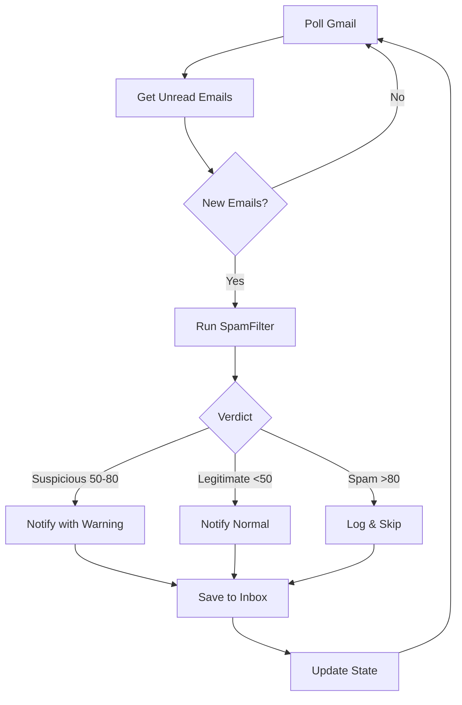

# Monitor Workflow

Continuous email monitoring workflow that polls Gmail accounts, runs spam detection, and sends Telegram notifications for legitimate emails.

## Trigger

This workflow runs:
- **As daemon**: Continuously every 2 minutes
- **Manual**: Single poll via `--once` flag

## Workflow Steps



## Commands

### Start Monitoring

```bash
# Single poll (dry run)
bun ~/.claude/skills/EmailManager/tools/EmailMonitor.ts --once --dry-run

# Single poll with notifications
bun ~/.claude/skills/EmailManager/tools/EmailMonitor.ts --once

# Daemon mode
bun ~/.claude/skills/EmailManager/tools/EmailMonitor.ts --daemon

# Using manage.sh
~/.claude/skills/EmailManager/tools/manage.sh start
```

### Stop Monitoring

```bash
~/.claude/skills/EmailManager/tools/manage.sh stop
```

### Check Status

```bash
~/.claude/skills/EmailManager/tools/manage.sh status
```

### View Logs

```bash
~/.claude/skills/EmailManager/tools/manage.sh logs
```

## State Management

State is persisted to `data/email-state.json`:

```json
{
  "personal": {
    "lastMessageId": "18d5a7b2c3e4f5a6",
    "lastCheck": "2026-02-05T14:30:00.000Z"
  },
  "workspace": {
    "lastMessageId": "18d5a7b2c3e4f5a7",
    "lastCheck": "2026-02-05T14:30:00.000Z"
  }
}
```

## Spam Filter Layers

Each email is scored through 4 layers:

| Layer | Weight | What It Checks |
|-------|--------|----------------|
| Auth Headers | 40% | SPF, DKIM, DMARC from `Authentication-Results` |
| Sender Reputation | 20% | Known domains, suspicious patterns |
| Content Analysis | 20% | URLs, urgency language, display name |
| AI Analysis | 20% | Claude Haiku spam probability |

## Telegram Notification Format

### Legitimate Email

```
📧 New Email

From: John Doe
To: personal
Subject: Meeting Tomorrow

Hey, just wanted to confirm our meeting for tomorrow at 2pm...

Open in Gmail: [link]
```

### Suspicious Email

```
⚠️ New Email

From: Support
To: workspace
Subject: Urgent: Verify Your Account

Please verify your account immediately by clicking...

⚠️ Flagged as Suspicious (score: 65)
Reason: urgency_language, suspicious_urls_1

Open in Gmail: [link]
```

## Data Files

| File | Purpose |
|------|---------|
| `data/email-state.json` | Last processed message IDs |
| `data/emailmonitor.pid` | Daemon PID file |
| `data/emailmonitor.log` | Service log file |
| `data/inbox/YYYY-MM/*.json` | Processed email records |
| `data/spam-log/YYYY-MM-DD.jsonl` | Spam filter decisions |

## Service Deployment

For production deployment on your host machine:

```bash
# Copy service file
sudo cp ~/.claude/skills/EmailManager/linux-service/emailmanager.service /etc/systemd/system/

# Enable and start
sudo systemctl daemon-reload
sudo systemctl enable emailmanager
sudo systemctl start emailmanager

# Check status
sudo systemctl status emailmanager
```

## Troubleshooting

### No notifications received

1. Check Telegram credentials in `~/.claude/.env`
2. Verify OAuth tokens are valid: `bun GmailClient.ts info --account personal`
3. Check logs: `manage.sh logs`

### Service not starting

1. Verify bun path: `which bun`
2. Check systemd logs: `journalctl -u emailmanager -f`
3. Test manual run: `bun EmailMonitor.ts --once`

### Spam filter too aggressive

1. Review spam logs: `tail -f data/spam-log/$(date +%Y-%m-%d).jsonl`
2. Adjust threshold in SpamFilter.ts (default: 80)
3. Add trusted domains to KNOWN_GOOD_DOMAINS
