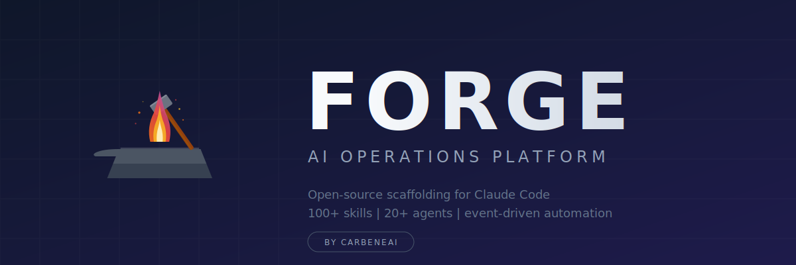

<div align="center">

<picture>
  <source media="(prefers-color-scheme: dark)" srcset="./forge-banner.svg">
  <source media="(prefers-color-scheme: light)" srcset="./forge-banner.svg">
  
</picture>

<br/>

### Open-source AI operations platform built on Claude Code

[](https://github.com/CarbeneAI/Forge/releases)
[](LICENSE)
[](https://claude.ai/code)
[]()


<br/>

[**Quick Start**](#-quick-start) · [**Skills**](#-skills) · [**Agents**](#-agents) · [**Architecture**](#-architecture) · [**Documentation**](#-documentation)

</div>

---

## What is Forge?

Forge is an open-source scaffolding system that transforms [Claude Code](https://claude.ai/code) into a personalized AI operations platform. It provides skills-based architecture, specialized agent personalities, event-driven automation, and automatic work capture — turning a generic AI assistant into one that knows your projects, preferences, and workflows.

```
You <-> Claude Code <-> Forge Configuration <-> Claude AI
        (CLI Tool)      (Your Context)          (AI Model)
```

**Without Forge:** Generic Claude with no memory of your stack, projects, or preferences.
**With Forge:** An AI assistant that knows your infrastructure, activates domain-specific skills on demand, delegates to specialized agents, and captures everything for future sessions.

| Component | What It Does |
|-----------|-------------|
| **Skills** | Self-contained AI capabilities with automatic trigger routing (~125 included) |
| **Agents** | Specialized AI personalities — architect, engineer, security auditor, researcher |
| **Hooks** | Event-driven TypeScript automation (session start/end, tool use, context compression) |
| **History** | Automatic documentation system that captures sessions, learnings, and research |

---

## Why Forge?

Most AI coding tools give you autocomplete. Forge gives you an **AI operations team** — with memory, security gates, parallel research, and a development workflow that catches vulnerabilities before they ship.

### Persistent Memory Across Sessions

Forge remembers your projects, preferences, decisions, and context between conversations. No more re-explaining your stack, your architecture choices, or your coding style every session. Semantic memory with temporal knowledge graphs means Forge gets smarter the more you use it. Works on macOS and Linux with cross-platform SQLite (better-sqlite3 + sqlite-vec for vector search).

### Multi-Source Research in Parallel

Launch research across 5+ AI models simultaneously — Claude, Gemini, Perplexity, Grok, and local Ollama. Each brings different strengths. Results are synthesized into a single, comprehensive analysis. One prompt, five perspectives.

### 125+ Skills with Auto-Activation

Say "research VitePress alternatives" and the Research skill activates automatically. Say "create a CLI tool" and CreateCLI takes over. No slash commands to memorize — skills route based on natural language triggers. Categories span security, development, business advisory, document processing, QA, and more.

### 20+ Specialized Agents

Not generic "assistants" — purpose-built agent personalities with distinct expertise. A software architect (Bezalel) who writes PRDs. A security auditor (Nehemiah) who reviews every PR for OWASP compliance. A penetration tester (Ehud). An incident responder (Gideon). Each agent knows its domain deeply.

### Real-Time Observability

Live WebSocket dashboard showing agent activity, tool invocations, and event timelines as they happen. Swim lane visualization for multi-agent orchestration. Know exactly what your AI is doing, when, and why.

### Privacy-First Local Routing

Route sensitive prompts to your local Ollama instance — data never leaves your machine. Suitable for HIPAA, PCI, and client-confidential work. One command: `/private`.

### Automatic Work Capture

Every session, every learning, every research output is automatically documented and organized by date. Search across months of AI-assisted work instantly. Nothing is lost.

---

## Security Built In, Not Bolted On

Most AI tools treat security as an afterthought — a linter you run after the code is written, a review you do when you remember. Forge embeds security into every stage of the development lifecycle.

### Mandatory Security Gates

Every code change passes through **Nehemiah** (security auditor agent) before it ships. This isn't optional. OWASP Top 10 compliance checking, SAST analysis, authentication flow review, and dependency vulnerability scanning happen automatically as part of the DevTeam workflow.

### Compliance Agents on Demand

**Daniel** (compliance specialist) handles SOX, GDPR, HIPAA, PCI-DSS, and SOC 2 assessments. Need to verify your application meets regulatory requirements? Ask Daniel — he'll audit your codebase against the specific framework and produce actionable findings.

### Offensive Security Testing

**Ehud** (penetration tester) runs authorized security assessments against your applications. Combined with the **OSINT**, **RedTeam**, **pentest-workflow**, and **CybersecurityPlaybooks** skills (24 ATT&CK-mapped offensive playbooks covering Kerberoasting, BloodHound, Sliver C2, AD Certificate abuse, Zerologon, DCSync, and more), Forge provides offensive security capabilities typically reserved for dedicated security teams.

### Incident Response

When production breaks, **Gideon** (incident responder) activates — crisis management, rapid debugging, root cause analysis, and post-mortem documentation. Integrated with the **WazuhDashboard** skill for real-time SIEM alert monitoring and triage.

### Privacy by Design

The **Private** skill routes sensitive queries to local models (Ollama/Gemma4) that run on your hardware. Client data, financial projections, medical records — nothing touches external APIs. Combined with the two-repository pattern (private config vs. public code), secrets never leak.

### Protected File System

Critical configuration files are tracked in `.pai-protected.json` with automated validation. API keys live in `.env` (always gitignored). Every `git push` is preceded by sensitive data checks. The system is designed to make accidental exposure difficult.

### Security Skill Arsenal

| Skill | Purpose |
|-------|---------|
| **OSINT** | Open-source intelligence gathering |
| **RedTeam** | Adversarial analysis and attack simulation |
| **pentest-workflow** | Structured penetration testing methodology |
| **Ffuf** | Web fuzzing and directory discovery |
| **WazuhDashboard** | Real-time SIEM monitoring and alert triage |
| **CSO** | Chief Security Officer strategic review |
| **cso** | Security posture assessment |
| **CybersecurityPlaybooks** | 24 ATT&CK-mapped offensive security playbooks — Kerberoasting, BloodHound, Sliver C2, Zerologon, DCSync, sqlmap, Nmap, Metasploit, and more |

### Security Agent Roster

| Agent | Role | Why It Matters |
|-------|------|----------------|
| **Nehemiah** | Security auditor | Catches OWASP vulnerabilities before they ship |
| **Daniel** | Compliance specialist | Ensures regulatory frameworks are met |
| **Ehud** | Penetration tester | Finds what scanners miss |
| **Gideon** | Incident responder | Minimizes blast radius when things break |

> **The difference:** Other AI tools help you write code faster. Forge helps you write code that's **secure by default** — with the same depth of security review that enterprises pay six figures for, built into your personal development workflow.

---

## Quick Start

### Linux / macOS

```bash
git clone https://github.com/CarbeneAI/Forge.git ~/Forge
bash ~/Forge/scripts/setup-new-machine.sh
```

### Windows (WSL)

Forge runs on Windows via WSL (Windows Subsystem for Linux). Claude Code requires a Linux environment.

**1. Install WSL** (if not already installed — run in PowerShell as Administrator):

```powershell
wsl --install -d Ubuntu
```

Restart your machine, then open Ubuntu from the Start menu and create your Linux username/password.

**2. Install Claude Code in WSL:**

```bash
# Install Node.js (required for Claude Code)
curl -fsSL https://deb.nodesource.com/setup_22.x | sudo -E bash -
sudo apt-get install -y nodejs

# Install Claude Code
npm install -g @anthropic-ai/claude-code

# Verify
claude --version
```

**3. Install Forge:**

```bash
git clone https://github.com/CarbeneAI/Forge.git ~/Forge
bash ~/Forge/scripts/setup-new-machine.sh
```

**WSL Tips:**
- Access Windows files from WSL at `/mnt/c/Users/YourName/`
- VS Code: Install the "WSL" extension, then `code .` from WSL opens VS Code connected to your Linux environment
- JetBrains: Use the Remote Development gateway to connect to WSL
- Terminal: Windows Terminal gives the best experience for WSL sessions
- GPU: WSL2 supports CUDA passthrough for local Ollama models — install NVIDIA drivers on Windows (not inside WSL)

### Post-Install (all platforms)

The setup script will:
- Create symlink: `~/.claude` -> `~/Forge/.claude`
- Configure `PAI_DIR` in settings.json for your machine
- Install Bun (if not present)
- Install Node.js (if not present, required for SemanticMemory on macOS)
- Build native SQLite extension (`better-sqlite3` + `sqlite-vec`)
- Add shell aliases to your `.bashrc` or `.zshrc`
- Create `.env` from template

**Add API keys (optional):**

```bash
nano ~/Forge/.claude/.env
```

```bash
GOOGLE_API_KEY=your_key          # Gemini research
PERPLEXITY_API_KEY=your_key      # Perplexity research
```

**Start:**

```bash
source ~/.bashrc  # or ~/.zshrc on macOS
claude
```

**Verify:**

```bash
forge-check   # Verify configuration
forge-test    # Run health check
forge-help    # See all commands
```

---

## Shell Commands

| Command | Description |
|---------|-------------|
| `forge` | Go to Forge directory |
| `forge-status` | Git status |
| `forge-pull` | Pull latest from GitHub |
| `forge-push` | Commit and push all changes |
| `forge-sync` | Pull then push (full sync) |
| `forge-check` | Verify configuration |
| `forge-test` | Run health check |
| `forge-skills` | List all skills |
| `forge-agents` | List all agents |
| `forge-new-skill <name>` | Create new skill from template |

---

## Skills

Skills are self-contained AI capability packages that activate automatically based on trigger words in your requests. Each skill contains routing logic, workflows, reference docs, and CLI tools.

### Included Skills (~125)

| Category | Skills |
|----------|--------|
| **Core** | CORE (identity/config), Fabric (248 AI patterns), Research (multi-source), Observability (real-time dashboard) |
| **Privacy** | Private (route to local Ollama/Gemma4), OllamaResearcher (local AI research) |
| **Security** | OSINT, RedTeam, pentest-workflow, Ffuf, WazuhDashboard, CSO, CybersecurityPlaybooks (24 ATT&CK-mapped offensive playbooks) |
| **Development** | DevTeam (multi-agent dev), CodingAgent, CreateCLI, test-driven-development |
| **Web** | BrightData (4-tier scraping), browse (headless Playwright), connect-chrome |
| **Business** | ceo-advisor, cto-advisor, cfo-advisor, AlexHormoziPitch, pricing, mvp, validate-idea |
| **Content** | Art, ArtGenerator, Prompting, StoryExplanation, CallIntelligence |
| **Documents** | pdf-processing-pro, xlsx, MarkItDown, Obsidian |
| **Operations** | Trading, EmailManager, TelegramBot, TelegramStatus, DiscordAdmin |
| **Workflow** | WritingPlans, ExecutingPlans, WorkflowOrchestration, Algorithm, Governance |
| **QA & Review** | qa, qa-only, review, benchmark, design-review, PeerScan, ReviewBrief |

### Creating Your Own

```bash
forge-new-skill MySkill
# Or: "Create a new skill for [purpose]"
```

Every skill follows this structure:

```
skills/SkillName/
├── SKILL.md              # Definition with YAML frontmatter and USE WHEN triggers
├── workflows/            # Step-by-step procedures (TitleCase.md)
├── reference/            # Deep-dive documentation (TitleCase.md)
└── tools/                # CLI utilities (TitleCase.ts)
```

### Skill Activation

Skills activate via natural language — no slash commands needed:

```
You: "Research VitePress alternatives"
-> Research skill activates -> launches parallel agents -> synthesizes findings

You: "Create a CLI tool for managing posts"
-> CreateCLI skill activates -> generates TypeScript CLI with tests
```

---

## Agents

Forge uses specialized agent personalities for different tasks. Agents are invoked via Claude Code's task system and configured in `.claude/agents/`.

### Agent Roster

| Agent | Role | Model |
|-------|------|-------|
| **Bezalel** | Software architecture, PRDs, system design | sonnet |
| **Hiram** | Software engineering, code implementation | sonnet |
| **Miriam** | UI/UX design, visual design, prototyping | sonnet |
| **Solomon** | Principal engineer guidance, code reviews | sonnet |
| **Deborah** | Critical thinking, assumption challenging | sonnet |
| **Nehemiah** | Security auditing, OWASP compliance | opus |
| **Daniel** | Compliance (SOX, GDPR, HIPAA, PCI-DSS) | opus |
| **Gideon** | Incident response, crisis management | opus |
| **Ehud** | Penetration testing, security assessments | sonnet |
| **Phoebe** | CMO — content marketing, brand strategy | sonnet |
| **Aquila** | VP Sales — pipeline, CRM, outreach | sonnet |
| **Jethro** | COO — operations, service delivery | sonnet |
| **Joshua** | Project manager — task boards, coordination | sonnet |
| **Ezra** | QA engineer — test suites, validation | sonnet |
| **Silas** | Video content producer | sonnet |

Research agents connect to external AI APIs: Claude, Gemini, Perplexity, Grok, and local Ollama.

### When to Use Which Agent

| Task | Agent |
|------|-------|
| Design a system | Bezalel |
| Write code | Hiram |
| Design UI | Miriam |
| Code review | Solomon |
| Challenge assumptions | Deborah |
| Security audit | Nehemiah |
| Pentest | Ehud |
| Production incident | Gideon |

---

## Architecture

### The Thirteen Founding Principles

Forge is built on 13 foundational principles:

1. **Clear Thinking + Prompting is King** — Quality thinking before code
2. **Scaffolding > Model** — System architecture matters more than the AI model
3. **As Deterministic as Possible** — Same input, same output
4. **Code Before Prompts** — Write code, use prompts to orchestrate
5. **Spec / Test / Evals First** — Define behavior before implementation
6. **UNIX Philosophy** — Do one thing well, compose through interfaces
7. **ENG / SRE Principles** — Treat AI infrastructure as infrastructure
8. **CLI as Interface** — Every operation accessible via command line
9. **Goal -> Code -> CLI -> Prompts -> Agents** — Proper development pipeline
10. **Meta / Self Update System** — System can improve itself
11. **Custom Skill Management** — Skills as organizational units for domain expertise
12. **Custom History System** — Automatic capture and preservation
13. **Custom Agent Personalities** — Specialized agents for different tasks

Full philosophy: [`.claude/skills/CORE/CONSTITUTION.md`](.claude/skills/CORE/CONSTITUTION.md)

### Directory Structure

```
~/Forge/
├── .claude/
│   ├── settings.json          # Configuration (PAI_DIR, DA name, env vars)
│   ├── .env                   # API keys (never committed)
│   ├── mcp.json               # MCP server configuration
│   ├── hooks/                 # Event-driven automation (TypeScript)
│   │   ├── initialize-session.ts
│   │   ├── capture-all-events.ts
│   │   ├── capture-tool-output.ts
│   │   ├── stop-hook.ts
│   │   └── lib/pai-paths.ts   # Centralized path resolution
│   ├── skills/                # ~125 domain-specific capabilities
│   │   ├── CORE/              # Identity, architecture, principles
│   │   ├── Fabric/            # 248 native AI patterns
│   │   ├── Research/          # Multi-source research workflows
│   │   ├── Private/           # Local Ollama privacy routing
│   │   ├── Observability/     # Real-time agent monitoring dashboard
│   │   └── [90+ more]/
│   ├── agents/                # Specialized agent configs
│   ├── history/               # Automatic work capture (UOCS)
│   └── tools/                 # System utilities
├── scripts/
│   ├── setup-new-machine.sh   # Initial setup
│   └── pai-aliases.sh         # Shell aliases
├── docs/                      # Guides and references
└── README.md
```

### Hooks

Event-driven TypeScript automation executed via Bun:

| Hook | Event | Purpose |
|------|-------|---------|
| `initialize-session.ts` | SessionStart | Load context and environment |
| `load-core-context.ts` | SessionStart | Auto-load CORE skill |
| `capture-all-events.ts` | PreToolUse | Log tool invocations |
| `capture-tool-output.ts` | PostToolUse | Capture tool results |
| `capture-session-summary.ts` | SessionEnd | Preserve session learnings |
| `stop-hook.ts` | Stop | Capture context on stop |
| `context-compression-hook.ts` | PreCompact | Manage context compression |

### History System (UOCS)

Automatic capture preserves all work:

```
history/
├── sessions/          # Session summaries (YYYY-MM/)
├── learnings/         # Problem-solving narratives (YYYY-MM/)
├── research/          # Analysis outputs (YYYY-MM/)
└── raw-outputs/       # Event logs (YYYY-MM/)
```

### Privacy Mode

Route sensitive queries to your local Ollama server — data never leaves your machine:

```
/private Analyze these financial projections for Client X
```

Uses Gemma4 31B (or any model on your Ollama instance) via `localhost:11434`. Suitable for HIPAA/PCI-sensitive data.

---

## Multi-Machine Sync

Forge syncs across machines via Git:

```
┌──────────────────────────────────────────┐
│           GitHub (Private Repo)           │
└──────────────────────────────────────────┘
                    │
         ┌──────────┼──────────┐
         v          v          v
    ┌────────┐ ┌────────┐ ┌────────┐
    │ Linux  │ │  Mac   │ │ Laptop │
    │ Server │ │ Studio │ │        │
    └────────┘ └────────┘ └────────┘
```

```bash
# On any new machine
git clone https://github.com/CarbeneAI/Forge.git ~/Forge
bash ~/Forge/scripts/setup-new-machine.sh

# Daily workflow
forge-pull   # Get latest
forge-push   # Save changes
```

> **Note:** `PAI_DIR` in settings.json is machine-specific. The setup script auto-configures it per machine.

---

## Technology Stack

| Category | Choice |
|----------|--------|
| **Runtime** | Bun (hooks, tools) + Node.js/tsx (SemanticMemory) |
| **Language** | TypeScript |
| **Package Manager** | Bun |
| **AI Platform** | Claude Code |
| **Format** | Markdown |

> **Why two runtimes?** Most Forge tools run on Bun for speed. SemanticMemory uses `better-sqlite3` (via `npx tsx`) because Bun's built-in SQLite cannot load native extensions (like sqlite-vec) on macOS. This ensures Forge works identically on macOS, Linux, and WSL.

---

## Documentation

All core docs live in `.claude/skills/CORE/`:

| Document | Description |
|----------|-------------|
| [**CONSTITUTION.md**](.claude/skills/CORE/CONSTITUTION.md) | System philosophy and 13 founding principles |
| [**SkillSystem.md**](.claude/skills/CORE/SkillSystem.md) | How to create your own skills |
| [**SKILL.md**](.claude/skills/CORE/SKILL.md) | Main configuration and identity |
| [**HookSystem.md**](.claude/skills/CORE/HookSystem.md) | Event-driven automation |
| [**HistorySystem.md**](.claude/skills/CORE/HistorySystem.md) | Automatic work documentation |
| [**Architecture.md**](.claude/skills/CORE/Architecture.md) | Complete architecture reference |

---

## Configuration

### Environment Variables (settings.json)

```json
{
  "env": {
    "PAI_DIR": "/home/you/.claude",
    "DA": "Forge",
    "CLAUDE_CODE_MAX_OUTPUT_TOKENS": "64000"
  }
}
```

### API Keys (.env)

All API keys go in `~/.claude/.env` (gitignored, never committed). Copy from `.env.example` to get started.

**Core (no API keys needed):**
Forge works out of the box with just Claude Code. All keys below unlock optional features.

**Research APIs:**

| Variable | Service | Used By | Free Tier? |
|----------|---------|---------|------------|
| `GOOGLE_API_KEY` | Google Gemini | Research, GeminiResearcher agent | Yes |
| `PERPLEXITY_API_KEY` | Perplexity AI | Research, PerplexityResearcher agent | No |
| `XAI_API_KEY` | xAI Grok | GrokResearcher agent | Yes |
| `OPENAI_API_KEY` | OpenAI (GPT, DALL-E, embeddings) | SemanticMemory, ArtGenerator | No |

**Communication:**

| Variable | Service | Used By | Free Tier? |
|----------|---------|---------|------------|
| `TELEGRAM_BOT_TOKEN` | Telegram Bot API | TelegramBot, TelegramStatus, notifications | Yes |
| `TELEGRAM_CHAT_ID` | Telegram | Notification target | Yes |
| `DISCORD_BOT_TOKEN` | Discord Bot API | DiscordAdmin skill | Yes |
| `DISCORD_GUILD_ID` | Discord | Server target | Yes |

**Trading (Joseph agent):**

| Variable | Service | Used By | Free Tier? |
|----------|---------|---------|------------|
| `ALPACA_API_KEY` | Alpaca Markets | Trading skill (paper/live) | Yes (paper) |
| `ALPACA_API_SECRET` | Alpaca Markets | Trading skill | Yes (paper) |

**Web Scraping & Content:**

| Variable | Service | Used By | Free Tier? |
|----------|---------|---------|------------|
| `BRIGHTDATA_API_TOKEN` | Bright Data | BrightData skill (Tier 4 scraping) | No |
| `REPLICATE_API_TOKEN` | Replicate | ArtGenerator (Flux, Stable Diffusion) | Limited |

**Infrastructure (self-hosted):**

| Variable | Service | Used By | Notes |
|----------|---------|---------|-------|
| `OLLAMA_URL` | Ollama | Private, OllamaResearcher | Default: `http://localhost:11434` |
| `OLLAMA_MODEL` | Ollama | Private, OllamaResearcher | Default: `gemma4:31b` |
| `N8N_API_URL` | n8n | Workflow automation (MCP) | Self-hosted |
| `N8N_API_KEY` | n8n | Workflow automation (MCP) | Self-hosted |

> **Security:** Never commit `.env` files. The `.gitignore` is pre-configured to exclude them. Run `git status` before pushing to verify.

---

## Origins & Acknowledgments

Forge started as a fork of [**Daniel Miessler's Personal AI Infrastructure (PAI)**](https://github.com/danielmiessler/Personal_AI_Infrastructure) — the original open-source vision for giving individuals the same AI scaffolding that companies spend millions building. Dan's core insight — that the best AI should be available to everyone, not locked inside corporations — is the foundation everything here is built on.

If you haven't read Dan's [**The Real Internet of Things**](https://danielmiessler.com/blog/real-internet-of-things), start there. It's the "why" behind this entire project. His 13 founding principles, skills-as-containers architecture, and CLI-first philosophy remain at the heart of Forge.

Dan is also the creator of [**Fabric**](https://github.com/danielmiessler/fabric) — the AI pattern framework with 248+ patterns that ships natively inside Forge. His work on making AI practical and accessible has shaped how thousands of people think about personal AI systems.

**What Forge adds on top of PAI:**
- 100+ skills (up from ~10) including 24 ATT&CK-mapped offensive security playbooks, 20+ specialized agents with distinct personalities
- Security-first development with mandatory audit gates (OWASP, SAST)
- Real-time observability dashboard with WebSocket streaming
- Privacy routing to local models (Ollama/Gemma4) for sensitive data
- Multi-agent orchestration with parallel execution
- Semantic memory with temporal knowledge graphs
- C-suite advisory agents (CTO, CFO, CEO, COO, CMO, CISO)

Built and maintained by [CarbeneAI](https://carbene.ai). Standing on the shoulders of Dan's original vision.

---

## License

MIT License — see [`LICENSE`](LICENSE) for details.

---

<div align="center">

**Your AI. Your rules. Your infrastructure.**

Built on [Claude Code](https://claude.ai/code) by Anthropic.

</div>
